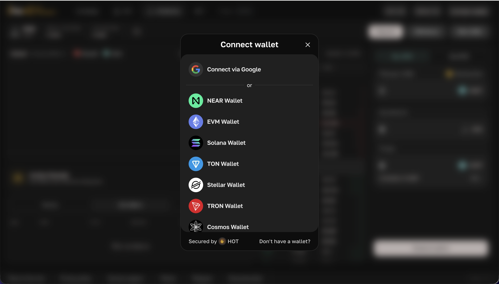

# MPC API

Public RPCs

* `https://rpc1.hotdao.ai`

## 1/2. Create wallet `/create_wallet`

<figure><figcaption></figcaption></figure>

#### 1. Generate a new Ed25519 keypair

Create a new keypair using your preferred cryptographic library (e.g., `pynacl`, `ed25519`).

* The **public key** becomes `wallet_derive_public_key`.
* You will use the **private key** to sign a proof of ownership.

#### 2. Get `derive` and `wallet_id` from the `wallet_derive_public_key`

```plaintext
derive = sha256(public_key_bytes)
wallet_id = base58_encode(sha256(sha256(public_key_bytes)))
```

This ensures every wallet is uniquely tied to its public key, and anyone can re-derive it for validation.

#### 3. Construct the proof message

You need to prove first authorization rule by signing a specific message.

```
"CREATE_WALLET:{wallet_id}:{auth_account_id}:{metadata}:{auth_msg}"
```

* `wallet_id`: the one you just derived.
* `auth_account_id`: authorization contract account id .g., `"keys.auth.hot.tg"`.
* `msg`: a JSON string that will be include in `on_auth_add(..)`  method&#x20;

Example `msg` string for `keys.auth.hot.tg`:

```json
{"public_keys":["your_base58_public_key"],"rules":[]}
```

#### 4. Sign the hashed message

Hash the **proof message** string with SHA-256 and sign the hash using your `wallet_derive_public_key` private key. Encode the signature in base58 — this becomes the `signature` field in the request.

#### 5. Assemble the full request

Your JSON request to the API should include:

* `wallet_id`: the value you derived from the public key.
* `wallet_derive_public_key`: your base58-encoded public key.
* `signature`: the base58-encoded signature of **proof message**
* `key_gen`: MPC Key generation , now always = 1.
* `auth`: containing:
  * `msg`:  JSON string that will be include in `on_auth_add(..)`  method&#x20;
  * `auth_account_id`: typically `"keys.auth.hot.tg"`

Example

```bash
curl 'https://rpc1.hotdao.ai/create_wallet' \
  -H 'accept-language: en-US,en;q=0.9' \
  -H 'content-type: application/json' \
  --data-raw '{
    "wallet_derive_public_key": "9buZSPUUSkzkYdaCMWh4vNAgz2Yi84VGW6Pqf5hegHCn",
    "wallet_id": "5Z5x7arDYpr4AM2BnLMPHPQ5nW6ryknBcbXSQGiQQcDK",
    "public_key": "9UWi6hXT31bV29LRQdX5gLKNiWcRfeARan7oiqHjHmDt",
    "signature": "24cEDwicHLD6Z7WMRnXa5WdfniRCxPwAA4r6f3WRGNQY9q7CaRAiTkgNo16uBRmy365obFprUj8C6giJiZyqmLqc",
    "key_gen": 1,
    "auth": {
      "msg": "{\"public_keys\":[\"9UWi6hXT31bV29LRQdX5gLKNiWcRfeARan7oiqHjHmDt\"],\"rules\":[]}",
      "auth_account_id": "keys.auth.hot.tg",
    }
  }'
```

## 2/2.Sign massage `/sign`&#x20;

<figure><figcaption></figcaption></figure>

our JSON request to the API should include:

* `wallet_derive`: the value you derived from the public key.
* `message`: your base58-encoded massage that need to be signed (hash(msg) for evm chains, raw massage for Solana)
* `curve_type`:&#x20;
  * 0 - EdDSA
  * 1 - Ecdsa
*   `user_payloads`: list of strings, that will be used in hot\_verify(..) method of your auth contracts. They must be in the same order as auth methods in MPC registed:

    ```
    near view mpc.hot.tg get_wallet {"wallet_id":"WALLET_ID"}
    ```
