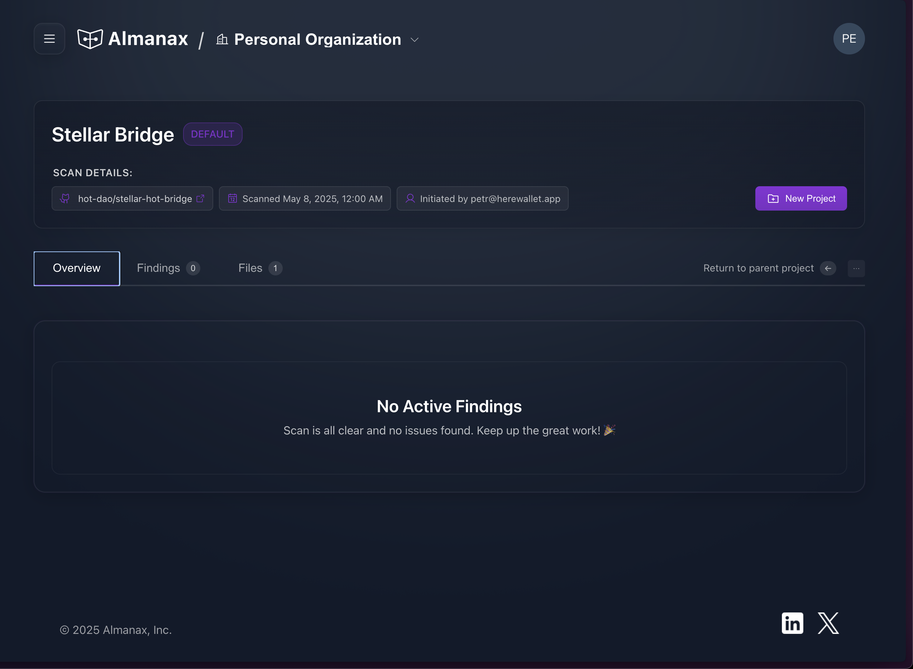

# Soroban Locker

## Code


Github Repo


Stellar Hot Bridge is a smart contract system designed to facilitate secure cross-chain transactions between Stellar blockchain and the "Omni Balance" contract on NEAR Protocol, using HOT Protocol MPC technology. This smart contract specifically implements the Stellar side of the bridge, handling deposits from Stellar to Omni Balance and withdrawals from Omni Balance to Stellar.

This contract represents only one component in a broader cross-chain transfer system. While Omni Balance on NEAR Protocol connects to multiple blockchains, this contract specifically handles the Stellar <-> Omni Balance connection.

#### Multi-Chain Transfer Example

A complete cross-chain transfer might follow this path:

```
USDC on Stellar → USDC.STELLAR on Omni Balance → USDC.BASE on Omni Balance → USDC on Base
```

**This contract's scope covers only:**

* USDC on Stellar → USDC.STELLAR on Omni Balance
* USDC.STELLAR on Omni Balance → USDC on Stellar

### How It Works


1.  **Deposit**:

    * User deposits any Stellar token to the bridge smart contract using the `deposit` method:

    ```
    pub fn deposit(
        env: Env,
        sender_id: Address,
        amount: u128,
        token: Address,
        receiver_id: BytesN<32>,
        client_timestamp: u128,
    ) -> u128
    ```

    * The function requires authorization from the sender and transfers the specified tokens to the contract.
    * It creates an RLP-encoded message containing nonce (client\_timestamp), chain\_id, token, receiver, and amount.
    * A SHA256 hash of this message is stored in persistent storage with the nonce as the key.
    * The function returns the nonce (client\_timestamp) to track this deposit.
    * Deposits can only be made with valid timestamps (not too old or in the future).
2.  **Withdrawal**:

    * Cross-chain validators observe and verify deposits from Omni Balance on NEAR to Stellar.
    * Once validated, a cryptographic signature is generated authorizing the release of tokens.
    * Users can initiate a withdrawal using the `withdraw` method:

    ```
    pub fn withdraw(
        env: Env,
        amount: u128,
        nonce: u128,
        token: Address,
        receiver: Address,
        signature: BytesN<65>,
    )
    ```

    * The function checks if the withdrawal with this nonce has already been processed.
    * It verifies the nonce timestamp isn't expired (within NONCE\_LIFETIME\_SECONDS).
    * It creates an RLP-encoded message with the same fields used for deposits.
    * The signature is verified using the contract's stored public key using secp256k1 recovery.
    * If verification succeeds, tokens are transferred to the receiver address.
    * The nonce is marked as processed to prevent double-spending.
3.  **Hot Verification**:

    * The `hot_verify` method is used by oracle nodes to verify deposit legitimacy:

    ```
    pub fn hot_verify(env: Env, wallet_id: String, data: BytesN<48>) -> bool
    ```

    * This method takes a wallet identifier and verification data containing a nonce and hash.
    * It extracts the nonce and hash from the input data.
    * It compares the provided hash against the stored hash for that nonce.
    * Returns true only if the hashes match, confirming the deposit is valid.
    * This verification ensures only legitimate cross-chain transactions can be processed.

#### Key Components:


1. **Signature Verification**: The contract uses secp256k1 signature recovery to verify withdrawal authorizations.
2. **Nonce Management**: A unique timestamp-based nonce system prevents replay attacks and double-spending.
3. **TTL Management**: The contract extends the Time-To-Live for both the contract instance and stored data to prevent expiration.

### Administrative Functions


The contract includes several administrative functions:

* `constructor`: Initializes the contract with a public key and owner address.
* `set_owner`: Allows the current owner to transfer ownership.
* `owner_withdraw`: Enables the owner to withdraw tokens from the contract.
* `set_public_key`: Updates the public key used for signature verification.
* `clear_deposit`: Removes a deposit record from storage.

### Security Features


1. **Double-Spend Prevention**: Withdrawals with the same nonce cannot be processed twice.
2. **Signature Verification**: Cryptographic signatures ensure only authorized withdrawals are processed.
3. **Timestamp Validation**: Deposits and withdrawals must have valid timestamps within acceptable ranges.
4. **Persistent Storage**: Critical data is stored with appropriate TTL settings to maintain system integrity.

## Security

1. Almanax Scan

<figure><figcaption></figcaption></figure>

2. Internal Audit by SDF ✅
3.
